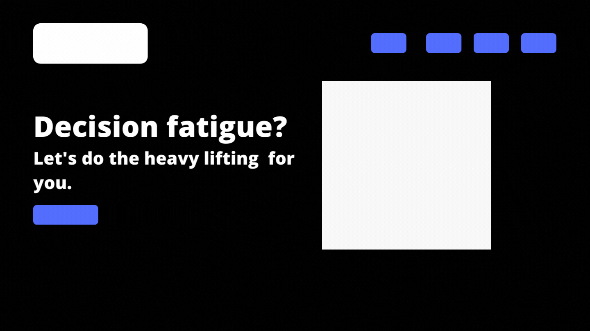

# Overview

Sometimes making simple decisions on what to cook for dinner, what to watch or what to listen to are super annoying.

This app helps solve that by making the decisions for you.

Take a look: https://decision-mkr.herokuapp.com/

# Technology Used

-   React
-   Node
-   TypeScript
-   Express
-   Axios
-   Material UI
-   React Router

# User Stories

-   As a user, I want my food/music/movie decisions simplified. Show me what to eat/listen to/watch so I can focus on other, more important decisions.
-   As a user, I want to guide how these simple decisions are made. Let me select some simple preferences so I can get value from these results.
-   As a user, I want the returned decisions to be randomised, so that I can see new results (almost) every time.

# Wireframes

# Next Steps
- Next stage is to add a feature that lets a user input the decision they need made; returning a randomised result
- I haven't taken full advantage of MUI's theme options, so code will be refactored to accommodate this

